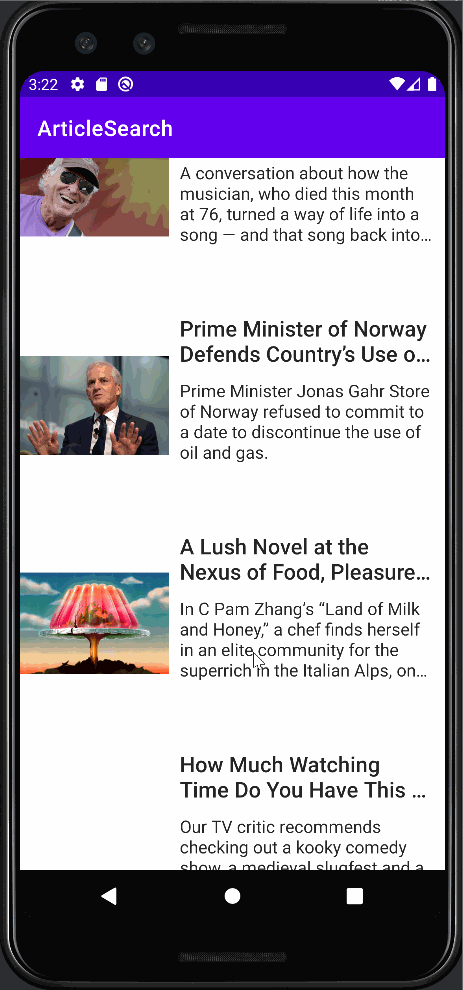

# Lab 3 - *Lab-Article-Search-App*

Submitted by: **Farouk Balogun**

**Lab-Article-Search-App** is a simple android app to browse from the New York Times.

Time spent: **2** hour spent in total

## Required Features

The following **required** functionality is completed:

- [X] **Articles are displayed using the RecyclerView**
- [X] **Can navigate to the Article Details screen**
- [X] **Article images are downloaded and displayed using Glide**

The following **optional** features are implemented:
- [ ] View elements are styled in the .xml files

## Video Walkthrough

Here's a walkthrough of implemented user stories:

<!-- Replace this with whatever GIF tool you used! -->
GIF created with [LiceCap](http://www.cockos.com/licecap).

## License

    Copyright [2023] [Farouk Balogun]

    Licensed under the Apache License, Version 2.0 (the "License");
    you may not use this file except in compliance with the License.
    You may obtain a copy of the License at

        http://www.apache.org/licenses/LICENSE-2.0

    Unless required by applicable law or agreed to in writing, software
    distributed under the License is distributed on an "AS IS" BASIS,
    WITHOUT WARRANTIES OR CONDITIONS OF ANY KIND, either express or implied.
    See the License for the specific language governing permissions and
    limitations under the License.
